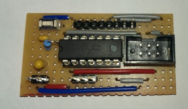
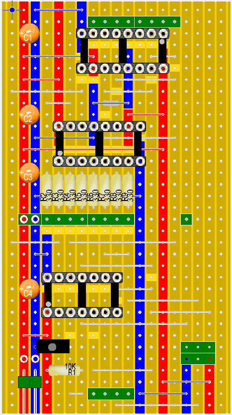

Conway's Game of Life
=====================

This small project is my contribution to [HACKADAY.IO 1kB Challenge](https://hackaday.io/contest/18215-the-1kb-challenge).

This example implements well known [**Conway's Game of Life**](https://en.wikipedia.org/wiki/Conway's_Game_of_Life).

How to play
-----------

First, you need to setup the initial lives (first generation) on the 8x8 LED matrix.

For that, you use 2 knobs (potentiometers) to point to a cell (blinking LED) and a button to change its state (alive or not).

You can define the first generation any way you see fit.

Once you are done with first generation setup, you can start the game by pressing the START button.

Then, generations get calculated and displayed, one after another, at regular intervals (speed is controllable through a third knob, from a few hundred ms to a few seconds).

The situation where we reach a generation with no cells alive, is detected and a smilie displayed to show that.

If the system reaches a stable situation (with live cells that never change), this is indicated by blinking those cells.

Circuit & Prototypes
--------------------

The circuit is based on an ATmel **ATtiny84A** AVR MCU that contains all logic.

The ATtiny84A has 8KB flash (code and init data) and 512 bytes RAM (for static and local variables in stack), hence a smaller MCU like ATtiny24 (2KB flash and 128 bytes RAM) would work as well, but I did not have any in my drawers, hence I did not test it.

The ATtiny84 is a tiny MCU with "only" 11 available IO pins (digital and some analogic).

Hence addressing an **8x8 LED matrix** is better done using SIPO (Serial In, Parallel Out) shift registers, I used 2 chained **74HC595**, one for matrix rows (LED anodes), the other for the columns (LED cathodes). I added current-limiting resistors to all 8 columns, to avoid roasting the MCU. Wiring for this takes only 3 digital output pins of the MCU (data, clock and latch).

LED matrix addressing is done though *multiplexing* (display one complete row at a time during a few ms, then display the next row, and so on). If all rows get "swept" fast enough, then human eye persistence makes you think all the matrix is displayed at the same time. I determined (after experiments) that showing each row during 2ms, then handling the next, i.e. 16ms to display all 8 rows, was the longest delay I could use.

For 1st generation setup, I originally used 3 push buttons, one Previous/Next pair to position the "cursor" (blinking LED) to the cell which we want to change state (dead or alive), then one button to switch the state of currently selected cell. This worked fine but that made the first phase very slow to setup for the end user. Wiring here required 3 digital inputs (one per button).

I hence decided to use 2 rotating knobs (potentiometers), just like the famous "Etch a Sketch" toy, to go faster to a position in the matrix. I kept one push button for changing the state of the currently selected cell. Wiring then took 2 analog input pins and 1 digital input pin.

The circuit has another button, used to start the game (used to tell the system that setup of the first generation is finished) and also suspend it at any time, then resume it.

Finally, to make the project a bit more challenging, trying to use the last available byte of code, I add a third potentiometer, used to control the speed of the game.

My first prototype was originally developed on an Arduino UNO (it uses an ATmega328P, compatible with ATtiny, with just more pins, more bytes and more features on chip). The advantage is that it is easy to upload programs to an Arduino with just a USB cable.

The rest of the circuit (LED matrix, resistors, SIPO IC, buttons, pots, caps) was originally put on 2 breadboards:

For the first tests on ATtiny84A, I have used a simple test board I have made that just contains the ATtiny84 with pin headers to all its pins: 

I then reused the same breadboard circuit as before. For these tests, the cicuit was powered through only 3.3V (instead of 5V on Arduino), that helped me fix current-limiting resistors for LEDs in order to keep high enough light output.

For the final circuit, I used two 50x90mm stripbard, stacked together, the above board containing all "UI" stuff (LED matrix, buttons, potentiometers), the under board with all electronics (MCU, IC, resistors, caps, ISP header). Both boards are stacked with pin headers, just like Arduino shields. I designed those with [LochMaster](http://www.abacom-online.de/uk/html/lochmaster.html).

Original LochMaster design files are [here](Conway-board-Logic.LM4) and [here](Conway-board-UI.LM4)  (these can be displayed with a [free viewer](http://www.abacom-online.de/updates/LochMaster40_Viewer.zip). Here are drawings of the stripboards:

 

And here are the actual stripboards ready:

TODO

Bill of Material
----------------

- 1 x ATtiny84A (but the system should work the same on an ATtiny44 or ATtiny24)
- 2 x 74HC595
- 1 x red LED matrix 8x8
- 1 x tantalum cap 10uF
- 3 x tantalum cap 100nF
- 1 x resistor 10K
- 8 x resistor 110 (TODO optimize this value?)
- 2 x tactile switch buttons extra small (6 x 3.5 x 3.5mm)
- 2 x square momentary buttons (12 x 12 x 6mm)
- 1 x female pin header 10 pins
- 1 x female pin header 8 pins
- 1 x female pin header 4 pins
- 1 x female pin header 1 pin
- 1 x male pin header 10 pins
- 1 x male pin header 8 pins
- 1 x male pin header 4 pins
- 1 x male pin header 1 pin
- 1 x male pin header 2 pins right angle 
- 1 x male 2x3 pins shrouded header
- 1 x IC socket DIP14
- 2 x IC socket DIP16
- 1 x USB female type A socket (THT)

Notes:

- TODO explain pin headers can be bought as long strips and cut to the right size.
- TODO explain male pin headers.
- TODO ISP header can be replace 2 male headers of 3 pins each
- TODO I prefer precision IC sockets rather than standard
- TODO USB socket is optional one can directly power the circuit through the 2 right angled pin headers
- TODO explain where I found my components

The code
--------

All code is written in C++ langauge (I use C++11 standard).

For some parts (digital IO, analog input), I decided to use some parts of my [FastArduino](TODO) library.

TODO mention toolchain, how to make (from github)...
TODO describe the main parts of the code, including used FastArduino stuff.
TODO mention template usage and possible use of bigger matrices at no cost on code size.

The challenge
-------------

Making all the program for this game to fit within 1KB of flash has been a big challenge.

Here is a summary of the general guideline I used to squeeze code size in this project:

- Don't use global variables as accessing them requires special `LDS`/`STS` instructions which are 4 bytes instead of 2 bytes for most AVR instructions. Also, global variables will trigger initialization code by GCC, which takes a few extra dozen bytes. Hence, exclusively use local variables everywhere.
- Don't use ISR (Interrupt Service Routines) as each ISR will generate more than 50 bytes of code, just to save current registers context to the stack and restore it before the end of ISR. Also using an ISR generally implies using one global variable (or more) to communicate information between the ISR and the main program loop.
- Avoid virtual methods in C++ classes as it generates `vtable` data for each class containing virtual methods (typically 4 bytes + 2 bytes per virtual method), stored in Flash and copied to SRAM at startup. Also, the code to call a virtual method is more instructions than for a non virtual method.
- Use C++ templates in a smart way, i.e. for all code that takes only one or a few instructions, e.g. for digital IO, FastArduino FastIO templates just generate inlined `CBI`/`SBI` instruction to clear or set the pin.
- Force inline methods (`inline` and `__attributes__((always_inline))`) when considered useful (e.g. very short methods or methods used only once). You may gain a lot by avoiding function prologues and epilogues.
- Use the smallest types that fit your data. AVR MCU are 8-bits processors, hence manipulating larger types than pure bytes will take more instructions. Also, prefer `unsigned` integral types to `signed` ones. Finally, avoid floating arithmetic at all costs as that will draw big libraries into your code size.
- Avoid multiplication or division at runtime (use compile-time operations for constants) as this will also require extra code libraries included into your program code. Division and multiplication are allowed only for power of 2 (simple left or right shifts then).
- Replace `switch` with `if...else if...` code blocks as it seems GCC produces a lot of code for `switch`.
- Concentrate all pins needed by your program to a single port of the MCU, that will allow simpler (and smaller) initialization code (e.g. to setup output/input for each pin through `DDRx` and `PORTx` registers).
- Replace several methods with similar behavior (e.g. refresh methods in `Multiplexer` class with different blink modes) into one with a bit more complex code (more `if` conditions) but smaller than the sum of code of all other methdos used in the project.
- Deal with several input buttons as a whole (by reading `PORT` and using bit masks to determine individual buttons state) rather than reading each bit individually.
- TODO MORE

**IMPORTANT**: note that these guidelines are not always possible in all projects; for instance, it is difficult to avoid ISR when you need to perform serial communication (UART, SPI, I2C), when you need a Timer...

The Contest
-----------

TODO evidence of 1KB claims.
