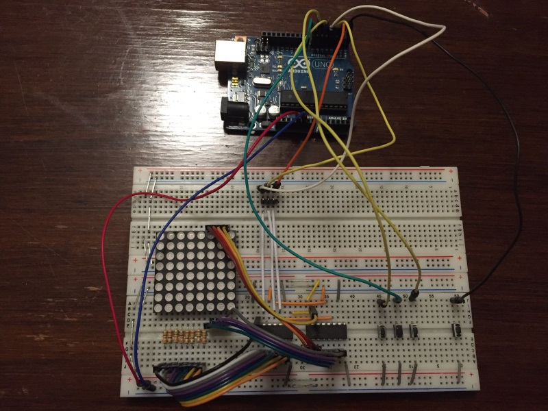
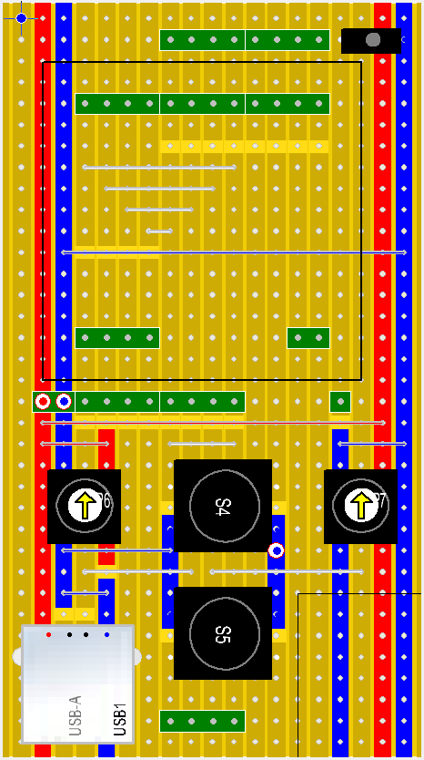
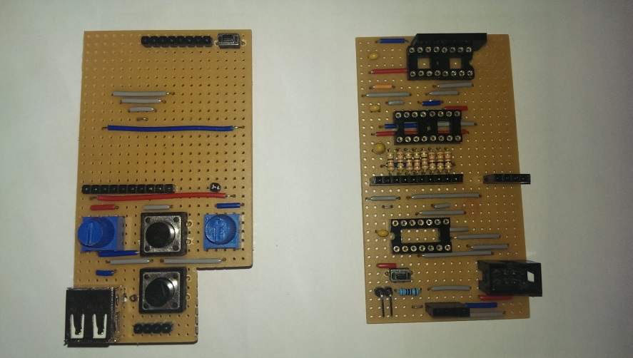
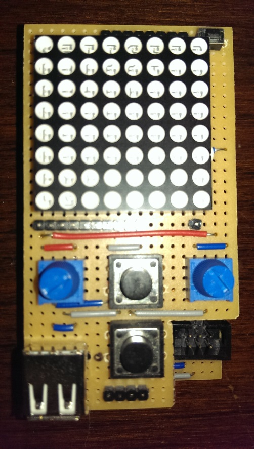
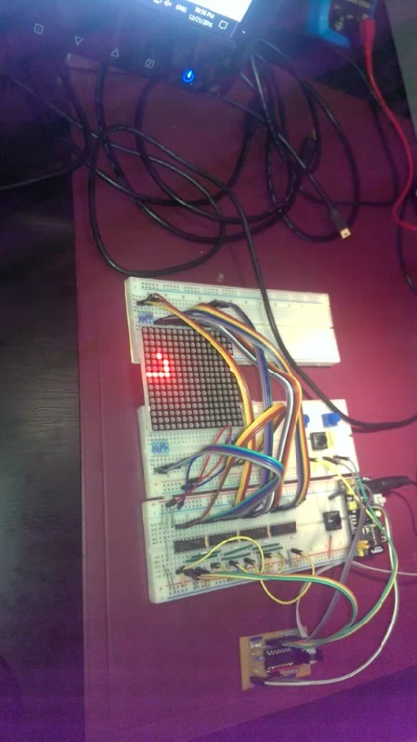

Conway's Game of Life
=====================

This small project is my contribution to [HACKADAY.IO 1kB Challenge](https://hackaday.io/contest/18215-the-1kb-challenge).

This example implements well known [**Conway's Game of Life**](https://en.wikipedia.org/wiki/Conway's_Game_of_Life).

Note that this implementation uses *Periodic Boundary Conditions* to simulate a field of an infinite size, i.e. each boundary is connected to the opposite boundary. This makes algorithm a bit more complex to implement but it mimics better the intent of this game.

How to play
-----------

First, you need to setup the initial lives (first generation) on the 8x8 LED matrix.

For that, you use 2 knobs (potentiometers) to point to a cell (blinking LED) and a button to change its state (alive or not).

You can define the first generation any way you see fit.

Once you are done with first generation setup, you can start the game by pressing the START button.

Then, generations get calculated and displayed, one after another, at regular intervals (speed is controllable through one of the two knobs used in the previous setup stage), from a few hundred ms to a few seconds.

The START button can also be used to pause the game, then resume it at a later time.

The situation where we reach a generation with no cells alive, is detected and a smiley displayed to show that.

If the system reaches a stable situation (with live cells that never change), this is indicated by blinking those cells.

Circuit & Prototypes
--------------------

The circuit is based on an ATmel **ATtiny84A** AVR MCU that contains all logic.

The ATtiny84A has 8KB flash (code and init data) and 512 bytes RAM (for static and local variables in stack), hence a smaller MCU like ATtiny24 (2KB flash and 128 bytes RAM) would work as well, but I did not have any in my drawers, hence I did not test it.

The ATtiny84 is a tiny MCU with "only" 11 available IO pins (digital and some analogic).

Hence addressing an **8x8 LED matrix** is better done using SIPO (Serial In, Parallel Out) shift registers, I used 2 chained **74HC595**, one for matrix rows (LED anodes), the other for the columns (LED cathodes). I added current-limiting resistors to all 8 columns, to avoid roasting the MCU. Wiring for this takes only 3 digital output pins of the MCU (data, clock and latch).

LED matrix addressing is done though *multiplexing* (display one complete row at a time during a few ms, then display the next row, and so on). If all rows get "swept" fast enough, then human eye persistence makes you think all the matrix is displayed at the same time. I determined (after experiments) that showing each row during 2ms, then handling the next, i.e. 16ms to display all 8 rows, was the longest delay I could use. In the final program, I use 1ms for that duration.

For 1st generation setup, I originally used 3 push buttons, one Previous/Next pair to position the "cursor" (blinking LED) to the cell which we want to change state (dead or alive), then one button to switch the state of currently selected cell. This worked fine but that made the first phase very slow to setup for the end user. Wiring here required 3 digital inputs (one per button).

I hence decided to use 2 rotating knobs (potentiometers), just like the famous "Etch a Sketch" toy, to go faster to a position in the matrix. I kept one push button for changing the state of the currently selected cell. Wiring then took 2 analog input pins and 1 digital input pin.

An analog joystick with a button on top would probably be the ideal device for this, but I did not have one at disposal. Anyway, the program and the wiring should remain the same (or roughly so for the wiring).

The circuit has another button, used to start the game (used to tell the system that setup of the first generation is finished) and also suspend it at any time, then resume it.

Finally, to make the project a bit more challenging, trying to use the last available byte of code, I decided to reuse one of the pots used in setup in order to control the speed of the game.

Here are the schematics for this circuit (made with [KiCAD](http://kicad-pcb.org/)):

My first prototype was originally developed on an Arduino UNO (it uses an ATmega328P, compatible with ATtiny, with just more pins, more bytes and more features on chip). The advantages are first that it is easy to upload programs to an Arduino with just a USB cable, then we can use ATmega328 UART (connected to USB) to send traces to a console, useful for debugging the program.

The rest of the prototype circuit (LED matrix, resistors, SIPO IC, buttons, pots, caps) was originally put on 2 breadboards:

For the first tests on ATtiny84A, I have used a simple test board I have made in the past, that just contains the ATtiny84 with pin headers to all its pins: 

I then reused the same breadboarded circuit as before.

For the final circuit, I used two 50x90mm stripbards, stacked together, the above board containing all "UI" stuff (LED matrix, buttons, potentiometers), the under board with all electronics (MCU, IC, resistors, caps, ISP header). Both boards are stacked with pin headers, just like Arduino shields. I designed those with [LochMaster](http://www.abacom-online.de/uk/html/lochmaster.html).

Original LochMaster design files are [here](Conway-board-Logic.LM4) and [here](Conway-board-UI.LM4)  (these can be displayed with a [free viewer](http://www.abacom-online.de/updates/LochMaster40_Viewer.zip)). Here are drawings of the stripboards:

UI board (above)             |  Logic board (under)
:-------------------------:|:-------------------------:
  |  

And here are the actual stripboards ready (without IC and LED matrix):

Final stacked boards, ready to operate:

Bill of Materials
-----------------

- 1 x ATtiny84A (but the system should work the same on an ATtiny44 or ATtiny24)
- 2 x 74HC595
- 1 x red LED matrix 8x8
- 1 x tantalum cap 10uF
- 3 x ceramic cap 100nF
- 1 x resistor 10K
- 8 x resistor 330 Ohm
- 2 x tactile switch buttons extra small (6 x 3.5 x 3.5mm)
- 2 x square momentary buttons (12 x 12 x 6mm)
- 1 x female pin header 10 pins
- 1 x female pin header 8 pins
- 1 x female pin header 4 pins
- 1 x female pin header 1 pin
- 1 x male pin header 10 pins
- 1 x male pin header 8 pins
- 1 x male pin header 4 pins
- 1 x male pin header 1 pin
- 1 x male pin header 2 pins right angle 
- 1 x male 2x3 pins shrouded header
- 1 x IC socket DIP14
- 2 x IC socket DIP16
- 1 x USB female type A socket (THT)

Notes:

- For male pin headers, I needed high headers (> 10mm) but I did not have any, hence I have used pin headers with 6mm on each side, then I have moved the headers on one side only (by applying a vertical pressure onto them, on a table), which gave me 12mm high headers.
- For the ISP header, I prefer using a shrouded 2x3 pins header, so I can use its notch to indicate how to plug the ISP programmer properly. If you don't have one, you can replace it with a double pin header (2x3) or even 2 pin headers of 3 pins each, but then be careful when plugging your programmer!
- For IC sockets, I used precision IC sockets rather than standard ones, because they offer some space, under the IC, where you can solder wires, which I did.
- The USB socket is used only for powering the circuit; it is purely optional as one can directly power the circuit through the 2 right angled pin headers on the lower board.
- Most components are quite standard except probably the LED matrix, which seems to be designed on demand by the retailer I got it from: http://www.play-zone.ch/en/bauteile/led/segmente-matrix/led-matrix-8x8-rot-3-7cm-x-3-7cm.html If you can't find the same component, then you can find any equivalent but then you'll have to redesign the upper board accordingly.

The code
--------

All code is written in C++ language (I use C++11 standard).

For some parts (digital IO, analog input), I decided to use some parts of my [FastArduino](https://github.com/jfpoilpret/fast-arduino-lib) library, which is actually a generic AVR library that I started writing in 2016, with a focus on code speed and size optimization.

I use the official **ATmel AVR 8-bit Toolchain 3.5.3 - Linux 64-bit** which is not the real latest toolchain (latest as of December 2016 was 3.5.4), but I guess building should work the same on latest 3.5.4 toolchain, but it may have different code size (better or worse).

Since I am currently satisfied with 3.5.3 toolchain, I do not foresee updating it within the next few months.

The program is divided into the following source files (excluding code from the FastArduino library itself):

- `Conway.cpp`: the main file, contains all constants used in the program (pin numbers, time delays...) and the `main()` function, in charge of instantiating all objects used by the program, and performing all 3 steps of the game: game setup, game loop, end of game.
- `Game.hh`: contains template `class GameOfLife` which points to the current generation state (as an array of unsigned integers) and implements the algorithm to progress from the current generation to the next one. The template is parameterized by the board size (number of rows and type of a row, defining the number of columns), but for the **hackaday.io 1KB challenge**, we use default values of 8x8.
- `Multiplexer.hh`: contains template `class MatrixMultiplexer`, plus a few helper classes, which is in charge of storing the state of each LED in the matrix, i.e. the state of the game board, and ensuring it is displayed through multiplexing, i.e. display one matrix row at a time, one after the other. This class also handles blinking of particular LEDs as needed. The template is parameterized by the board size (number of rows and number of columns), but for the **hackaday.io 1KB challenge**, we use default values of 8x8. The helper classes present in this file are *traits* classes, that are used to help determine settings, used by `MatrixMultiplexer`, different for each template intantiation, e.g. an 8x8 matrix Vs. a 16x16 matrix.
- `Button.hh`: a simple implementation of a debounced button wired on an input pin, with a pullup resistor.

Since the program does not use AVR Timers (see [below](#challenge) for an explanation why), classes with methods that depend on timing, e.g. `MatrixMultiplexer.refresh()`, `Button.state()`, use an internal counter with an upper limit which is calculated based on a hard-coded delay (1ms) used by the loop of each step of the game. That makes those classes hardly reusable in a real design, where one would prefer using a hardware timer; that's the reason why they are part of the Conway example, rather than being part of the FastArduino library itself.

Conway program uses the following subset of FastArduino library:

- `time.hh`: busy loop delay functions (us and ms)
- `AnalogInput.hh`: self explanatory
- `SIPO.hh`: handles output to a chain of one or more shift registers, through 3 output pins
- `FastIO.h`: handles digital IO (used by `Button.hh` and `SIPO.hh`)

Since the program is fully "templatized", this means it can easily be reused to handle other sizes of LED matrices. I successfully checked it on a 16x16 LED matrix (with 4 shift registers then); you can click on the picture below to open a video showing the game with the well-known "lightweight spaceship" pattern:

However, note that code size increases when compiled for larger matrices than 8x8:

- 8x8 matrix:   962 bytes
- 16x16 matrix: 1256 bytes

How to build the program (Linux)
--------------------------------

First off, ensure your Linux box contains the ATmel AVR 8 bit toolchain (I use 3.5.3, latest is 3.5.4) and your `$PATH` points to its `bin` directory.

The following commands show how to build the Conway 8x8 program:

    > git clone https://github.com/jfpoilpret/fast-arduino-lib.git
    > cd fast-arduino-lib
    > make CONF=ATtiny84-Release build
    > cd examples/complete/Conway
    > make CONF=ATtiny84-Release build

That's it! In a few seconds you get (in `dist/ATtiny84-Release/AVR-GNU-Toolchain-3.5.3-Linux`):

- `conway.hex`: the hexadecimal representation of conway executable program, ready to be uploaded to an ATtiny84
- `conway.dump.txt`: the full dump file, with assembly code, of conway executable program; that has been useful to track down where most code bytes were used, facilitating the selection of optimization focus

The following commands will upload the generated program to your ATtiny84, connected to your box through an **ArduinoISP** (that is a USB-ISP programmer that is very useful for AVR programming). You may as well use other programmers for this task, but then you'll probably have to update `Makefile-FastArduino.mk` file (part of FastArduino library) to accomodate your programmer:

    > make CONF=ATtiny84-Release fuses
    > make CONF=ATtiny84-Release flash

The first command sets the fuses of the MCU and is mandatory the first time you upload the program; you won't have to repeat this command on later uploads if you change the program.

Note that these "make targets" (`fuses` and `flash`) simply delegate all the work to the well-known `avrdude` binary, which must first be properly installed on your Linux box.

For more information on my personal build setup, you can refer to [this document](https://github.com/jfpoilpret/fast-arduino-lib/blob/master/ArduinoDevSetup.docx).

The challenge
-------------------------------------

Making all the program for this game to fit within 1KB of flash has been a big challenge.

Here is a summary of the general guideline I used to squeeze code size in this project:

- Don't use global variables as accessing them requires special `LDS`/`STS` instructions which are 4 bytes (instead of 2 bytes used by most AVR instructions). Also, global variables will trigger initialization code by GCC, which takes a few extra dozen bytes. Hence, exclusively use local variables everywhere.
- Don't use ISR (Interrupt Service Routines) as each ISR will generate more than 50 bytes of code, just to save current registers context to the stack and restore it before the end of ISR. Also using an ISR generally implies using one global variable (or more) to communicate information between the ISR and the main program loop.
- Avoid virtual methods in C++ classes as it generates `vtable` data for each class containing virtual methods (typically 4 bytes + 2 bytes per virtual method), stored in Flash and copied to SRAM at startup. Also, the code to call a virtual method is more instructions than for a non virtual method.
- Use C++ templates in a smart way, i.e. for all code that takes only one or a few instructions, e.g. for digital IO, FastArduino FastIO templates just generate inlined `CBI`/`SBI` instruction to clear or set the pin.
- Force inline methods (`__attributes__((always_inline))`) when considered useful (e.g. very short methods or methods used only once). You may gain a lot by avoiding function prologues and epilogues.
- Use the smallest types that fit your data. AVR MCU are 8-bits processors, hence manipulating larger types than pure bytes will take more instructions. Also, prefer `unsigned` integral types to `signed` ones. Finally, avoid floating arithmetic at all costs as that will draw big libraries into your code size.
- Avoid multiplication or division at runtime (use compile-time operations for constants) as this will also require extra code libraries included into your program code. Division and multiplication are allowed only for power of 2 (simple left or right shifts then).
- Replace `switch` with `if...else if...` code blocks as it seems GCC produces a lot of code for `switch`.
- Concentrate all pins needed by your program to a single port of the MCU, that will allow simpler (and smaller) initialization code (e.g. to setup output/input for each pin through `DDRx` and `PORTx` registers).
- Replace several methods with similar behavior (e.g. refresh methods in `Multiplexer` class with different blink modes) into one with a bit more complex code (more `if` conditions) but smaller than the sum of code of all other methdos used in the project.
- When using template classes with several instances (different template arguments), if some code in template is rather big, then try to factor it out to a non-template abstract base class, and make the template class derive from it.
- Replace "classical" algorithm to count neighbours of a cell to determine next generation, with an optimized bit-parallel processing, thus removing all conditional (only boolean operations on bytes) and removing an embedded loop for columns. This one change enabled more than 100 bytes gain in code size, let alone speed efficiency. Thanks [Yann Guidon](https://hackaday.io/whygee) for his suggestion on that one. it took me several days to understand how to do it but it was worth it.
- Remove vector table and GCC init code altogether (about 50 bytes). This was done by using option `-nostartfiles` at link time, in addition to creating specific `void __jumpMain() __attribute__((naked)) __attribute__((section (".init9")));` function, placed at address `0x0000` (i.e. directly jumped to at boot time and upon reset of the MCU) to call standard `main()`.

Some options I had in mind but did not need to use for this contest (hell, 1024 bytes is just too much :-)):

- Use AVR special `GPIORn` addresses; I am actually not sure whether and how I could have gained something with that, so I did not even try it.

**IMPORTANT**: note that these guidelines are not always possible in all projects; for instance, it is difficult to avoid ISR when you need to perform serial communication (UART, SPI, I2C), when you need a Timer...

The Contest
-----------

My build includes generation of 2 evidences that the program, built for the circuit with an 8x8 matrix, is under 1KB of code:

1. `avr-size` generates an output with program size information

2. `avr-objdump` generates a dump file `conway.dump.txt` with the list of all symbols and all assembly code part of the final executable

For an ATtiny84A (8KB available for code, 512 bytes for data), here is the output of `avr-size`:

	AVR Memory Usage
	----------------
	Device: attiny84

	Program:     962 bytes (11.7% Full)
	(.text + .data + .bootloader)

	Data:          0 bytes (0.0% Full)
	(.data + .bss + .noinit)

The dump file includes at its beginning the list of sections with their respective sizes:

	Sections:
	Idx Name          Size      VMA       LMA       File off  Algn
	  0 .text         000003c2  00000000  00000000  00000054  2**1
					  CONTENTS, ALLOC, LOAD, READONLY, CODE
	  1 .data         00000000  00800060  00800060  00000416  2**0
					  CONTENTS, ALLOC, LOAD, DATA
	  2 .comment      00000030  00000000  00000000  00000416  2**0
					  CONTENTS, READONLY

As one can see, the code size in `.text` section is 0x03c2, i.e. 962 bytes, whereas the `.data` section is empty.

This information is based on github code tagged "HACKADAY-1KB-CONTEST" at https://github.com/jfpoilpret/fast-arduino-lib/releases/tag/HACKADAY-1KB-CONTEST
